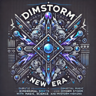

<b><a href="README.md">[English]</a> / [中文]</b>

<h1 align="center">
  
   
  次元風暴 - 新紀元
</h1>

## 簡介

這是一個以後世界末日為背景的模組包，玩家利用超能力與輕科技來生存並揭開災難性想子風暴背後的真相。

## 故事背景

在不久的未來，科學家們透過對超能力的研究，建立了現代魔法體系。另一端，木原幻生在 Level 6 能力者的計畫失敗後，絕望與瘋狂的他將目光轉向寄生物，試圖創造「超越者」，一種無法被階級所定義、超越一切的存在。然而實驗失控，一場巨大的想子風暴席捲了地球，並破壞了早已不穩定次元牆。無數的生命死去、繁華的城市荒廢、未知的生物在次元牆的擾動中被拉扯到地球。玩家需開發自身的超能力與運用 CAD 等知識，在這片面目全非的大陸上存活下去，並前往異次元探明那場悲劇的真相。
